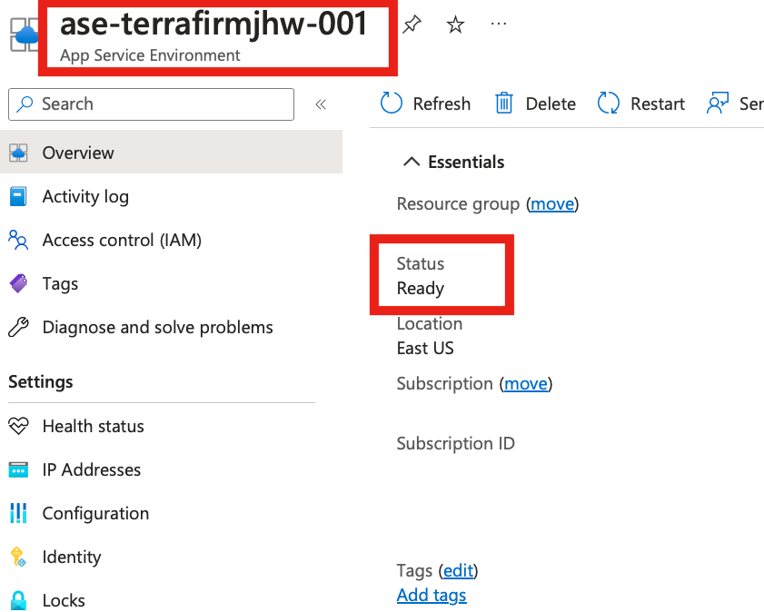
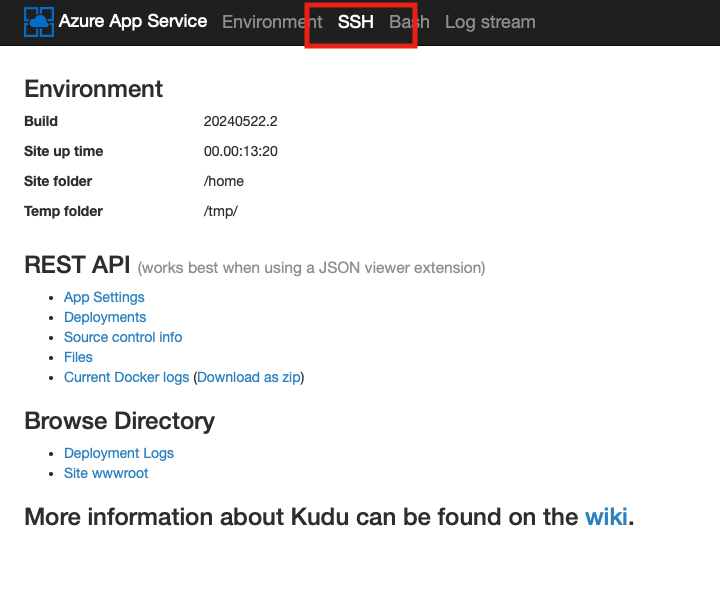
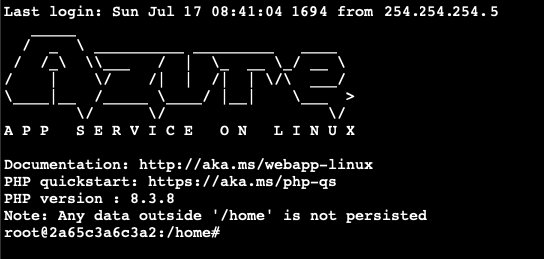
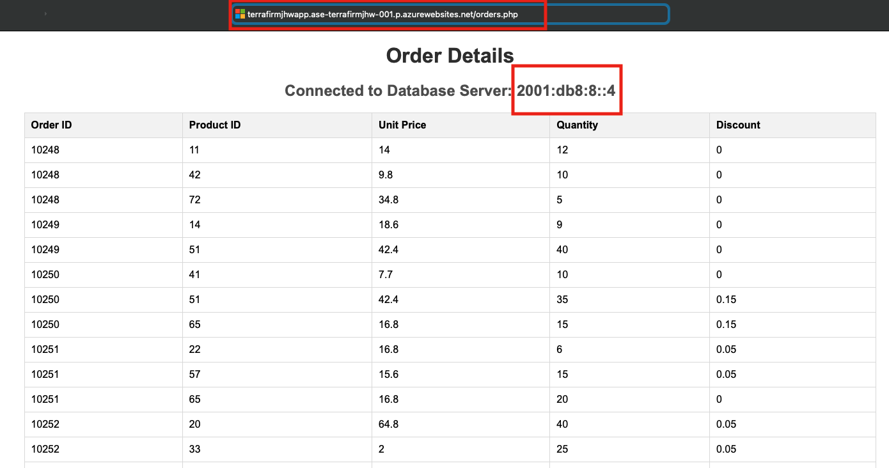

# Task 03 - Migrate the web application to an Azure App Service

## Introduction

This is an optional advanced exercise where you will create an app service that resides in an App Service Environment.
It is recommended that this exercise is performed either at the end of day one or over a break as the App Service Environment takes 3 hours to deploy.

## Description

In this task, you will deploy Azure resources used in this lab.

The key tasks are as follows:

1. Create an App Service Enviroinment that will host an App Service running the web application used in this lab. 

## Success Criteria

* The web application is running in an App Service which is hosted in an App Service Environment.

## Solution

<details markdown="block">
<summary>Expand this section to view the solution</summary>

1. Go to the **Azure Portal**.

At the top of the Azure Portal, select the **Cloud Shell** icon to open up the Azure Cloud Shell.


1. Within the **Cloud Shell**, enter the following commands - which will setup a new subnet to run the App Service Environment in.
    1. Run these commands substituting your own values - for example your resource group name and `terrafirm` name.

    ``` bash
    # Example names have been provided - replace with your own
    export terrafirmname=terrafirmjhw
    export resourcegroupname=az-techexcel-linux
    az network vnet subnet create --name app-service --resource-group $resourcegroupname --vnet-name $terrafirmname-spoke-vnet --address-prefixes "10.2.1.0/24"
    az network vnet subnet update --delegations "Microsoft.Web/hostingEnvironments" --name app-service --resource-group $resourcegroupname --vnet-name $terrafirmname-spoke-vnet
    ```

1. You will now run this command which can take up to 3 hours to complete. Your cloud shell session may timeout - at which point just track the status of the app service environment in the portal. It will have a status of **Preparing** which will change to **Ready** when the deployment has completed.

    >Note: if you have started a new cloud shell then export the variables you did in the previous step.

     ```bash
         az appservice ase create -n ase-$terrafirmname-001 -g $resourcegroupname --vnet-name $terrafirmname-spoke-vnet --subnet app-service --virtual-ip-type External --kind asev3
    ```

    

1. When the App Service Environment has been deployed, you will now create an App Service Plan which will host the App Service. Run this command to create the App Service Plan, replacing the variables with your own

    ```bash
    export terrafirmname=terrafirmjhw
    export resourcegroupname=az-techexcel-linux
    az appservice plan create -g $resourcegroupname -n asp-$terrafirmname-001 --app-service-environment ase-$terrafirmname-001 --sku I1V2 --is-linux    
    ```

1. When the App Service Plan has deployed, you can now deploy the App Service by running this command.

    >Note: if you have started a new cloud shell then export the variables you did in the previous step.

    ```bash
    az webapp create --resource-group $resourcegroupname --plan asp-$terrafirmname-001 --name $terrafirmnameapp --runtime "PHP|8.3"
    ```

You will now use the Advanced Tools in the App Service to configure the web app.

1. In the **Azure Portal**, navigate to the **Resource Group** that you created for this lab, then select the App Service you have created.

    

1. In the left hand pane browse to **Development Tools** and click on **Advanced Tools** then click **Go -->**

    

1. This will open a new tab hosting the Kudu tools - you will click on the SSH icon to open a remote SSH session to the App Service.

    

1. This will start a SSH session to the App Service:

    

1. Run these commands to configure the web application to use the PostgreSQL Database.

    ```bash
    apt install git-all -y
    git clone https://github.com/microsoft/TechExcel-Migrate-Linux-workloads.git
    cp TechExcel-Migrate-Linux-workloads/resources/deployment/onprem/webapp/orders.php site/wwwroot/orders.php
    nano site/wwwroot/orders.php
    ```

1. This will install the git utility, clone the web application, copy the PHP file into the correct location for a web service hosted in an App Service in Azure and finally bring up the nano editor so that you can edit the `orders.php` file.

1. You will edit the **host** entry and enter the **IPAddress** for the **Azure Database for PostgreSQL Flexible Server** instance that was previously created and configured in previous steps.

    

1. To save the file, press `^X` (ctrl-X) to exit the editor, press `Y` to save the modified buffer, then press **Enter** to write the changes to the file.

1. Go back to the **Azure Portal** navigate to the **Resource Group** that you created for this lab, then select the App Service you have created.

1. Select the App Service and find the default domain that it is hosting:

    

1. Copy the value and paste into a browser, be sure to use `http://` since the web application is not currently configured for TLS/SSL.

    ```text
    http://<default domain>
    ```

1. This will bring up the default web page for an Azure App Service hosting a web application:

    

1. Now put `orders.php` on the end of the URL to validate the web application is configured and running. You should get a page looking like this:

    

**Congratulations!!** You have migrated an on-premises PosgreSQL Database to Azure Database for PostgreSQL. You have also have migrated the web application from another on-premises server to hosting it in an Azure App Service running securely across a virtual network in an App Service Environment.

Normally this would mean you would also shutdown the on-premises application server, but you will use that server in the next exercises to simulate various ways to secure servers in Azure.

</details>
