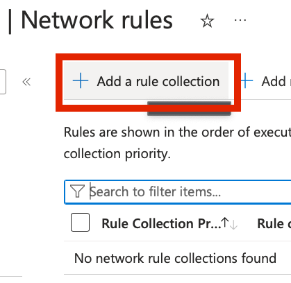
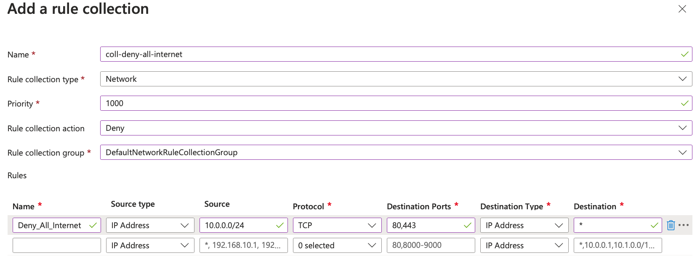
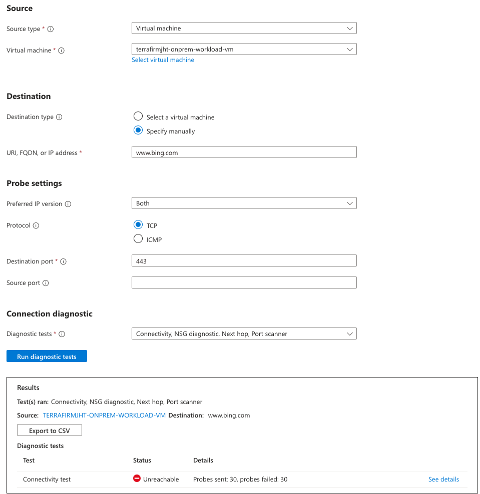

# Task 05 - Deploy and configure Azure Firewall

## Introduction

Terra Firm Laboratories is migrating their on-premises Linux workloads to Microsoft Azure. In this task, you will implement an Azure Firewall to protect network traffic. You will use the on-premises workload server to simulate a situation where a server has been migrated to Azure and it needs outgoing internet access cut to it.

## Description

In this task, you will implement an Azure Firewall to protect network traffic.

The key tasks are as follows:

1. Test network traffic from the Virtual Machine to the Internet. You should have access to bing.com.
1. Deploy Azure Firewall.
1. Configure rules to block access to bing.com.
1. Test network traffic from the Virtual Machine to the Internet. Access to bing.com is now blocked.

## Success Criteria

* Azure Firewall is deployed and fully working.

## Solution

Expand this section to view the solution

1. Sign-in to the Azure portal **`https://portal.azure.com/`**.

1. In the **Azure Portal**, navigate to the **Resource Group** that you created for this lab, then select the **On-premises Workload VM** named similar to `terrafirm-onprem-workload-vm`.

    

1. Click **Start** as in a previous exercise you stopped it.

1. In the Azure portal, in the **Search resources, services, and docs** text box at the top of the Azure portal page, type **Network Watcher** and press the **Enter** key.

1. Under **Network diagnostic tools**, select **Connection troubleshoot**

1. On the **Network Watcher | Connection troubleshoot** window, specify the following values:

   |Setting|Value|
   |---|---|
   |Source type|**Virtual Machine**|
   |Virtual Machine|Select the **terrafirm-onprem-workload-vm**|
   |Destination type|Select **Specify manually**|
   |URI, FQDN, or IP address|https://www.bing.com|
   |Preferred IP Version|Both|
   |Protocol|Select **TCP**|
   |Destination port|443|
   |Source port| |
   |Diagnostic tests|**Connectivity, NSG diagnostics, Next hop, Port scanner**|

   >**Note**: Connection should be sucessfull.

1. In the Azure portal, in the **Search resources, services, and docs** text box at the top of the Azure portal page, type **terrafirm-onprem-vnet** and press the **Enter** key.

1. Under **Settings**, select **Subnets**.

1. Select **+Subnet** and add a subnet with the Subnet purpose of **Azure Firewall** and the Starting address **10.0.100.0**

1. In the Azure portal, in the **Search resources, services, and docs** text box at the top of the Azure portal page, type **Firewalls** and press the **Enter** key.

1. On the **Firewalls** blade, select **+ Create**.

1. On the **Basics** tab of the **Create a firewall** blade, specify the following settings (leave others with their default values):

   |Setting|Value|
   |---|---|
   |Resource group|**YOUR RESOURCE GROUP**|
   |Name|**afw-onprem-001**|
   |Region|Your Region|
   |Firewall SKU|**Standard**|
   |Firewall management|**Use a Firewall Policy to manage this firewall**|
   |Firewall policy|Select **Add new**  Name: **afwp-onprem-001** Region: **your region**|
   |Choose a virtual network|select the **Use existing** option and, in the drop-down list, select **terrafirm-onprem-vnet**|
   |Public IP address|click **Add new** and type the name **pip-afw-onprem-001** and select **OK**|

1. Select **Review + create** and then select **Create**.

    >**Note**: Wait for the deployment to complete. This should take about 5 minutes.

1. In the Azure portal, in the **Search resources, services, and docs** text box at the top of the Azure portal page, type **Resource groups** and press the **Enter** key.

1. On the **Resource groups** blade, in the list of resource groups, select **YOUR RESOURCE GROUP** entry.

1. In the list of resources, select the entry representing the **afw-onprem-001** firewall.

1. On the **afw-onprem-001** blade, identify the **Private IP** address that was assigned to the firewall.

1. In the Azure portal, in the **Search resources, services, and docs** text box at the top of the Azure portal page, type **Route tables** and press the **Enter** key.

1. On the **Route tables** blade, click **+ Create**.

1. On the **Create route table** blade, specify the following settings:

    |Setting|Value|
    |---|---|
    |Resource group|**YOUR RESOURCE GROUP**|
    |Region| **Your Region**|
    |Name|**rt-onprem-001**|

1. Click **Review + create**, then click **Create**, and wait for the provisioning to complete. 

1. On the **Route tables** blade, click **Refresh**, and, in the list of route tables, click the **rt-onprem-001** entry.

1. On the **rt-onprem-001** blade, in the **Settings** section, click **Subnets** and then, on the **rt-onprem-001 \| Subnets** blade, click **+ Associate**.

1. On the **Associate subnet** blade, specify the following settings:

    |Setting|Value|
    |---|---|
    |Virtual network|**terrafirm-onprem-vnet**|
    |Subnet|**default**|

     >**Note**: Ensure the **default** subnet is selected for this route, otherwise the firewall won't work correctly.

1. Click **OK** to associate the firewall to the virtual network subnet.

1. Back on the **rt-onprem-001** blade, in the **Settings** section, click **Routes** and then click **+ Add**.

1. On the **Add route** blade, specify the following settings:  

    |Setting|Value|
    |---|---|
    |Route name|**route-fw-001**|
    |Destination type|**IP Address**|
    |Destination IP addresses/CIDR ranges|**0.0.0.0/0**|
    |Next hop type|**Virtual appliance**|
    |Next hop address|the private IP address of the firewall that you identified in the previous when creating the Azure Firewall|

     >**Note**: Azure Firewall is actually a managed service, but virtual appliance works in this situation.

1. Click **Add** to add the route.

1. In the Azure portal, navigate back to the **afw-onprem-001** firewall.

1. On the **afw-onprem-001** blade, in the **Firewall policy** section, select **afwp-onprem-001**.

1. On the **afwp-onprem-001** Firewall Policy blade, select **Network rules**, and then click **+ Add a rule collection**.

    

1. On the **Add a rule collection** blade, specify the following settings (leave others with their default values):

    |Setting|Value|
    |---|---|
    |Name|**coll-deny-all-internet**|
    |Rule collection type|**Network**|
    |Priority|**1000**|
    |Rule collection action|**Deny**|
    |Rule collection group|**DefaultNetworkRuleCollectionGroup**|

1. On the **Rules** Section, create a new entry with the following settings (leave others with their default values):

    |Setting|Value|
    |---|---|
    |Name|**Deny_All_Internet**|
    |Source type|**IP Address**|
    |Source|**10.0.0.0/24**|
    |Protocol|**TCP**|
    |Destination Ports|**80,443**|  
    |Destination|**`*`**|

    

1. Click **Add**

In order to test your setup, you can use the Connection Troubleshooting tool of **Network Watcher**. 

1. Use the "Search resources, services and docs" at the top of your Azure Portal windows to locate **Network Watcher** 

1. Under **Network diagnostic tools**, select **Connection troubleshoot**

1. On the **Network Watcher | Connection troubleshoot** window, specify the following values:

   |Setting|Value|
   |---|---|
   |Source type|**Virtual Machine**|
   |Virtual Machine|Select the **terrafirmworkloadvm**|
   |Destination type|Select **Specify manually**|
   |URI, FQDN, or IP address|https://www.bing.com|
   |Preferred IP Version|Both|
   |Protocol|Select **TCP**|
   |Destination port|443|
   |Source port||
   |Diagnostic tests|**Connectivity, NSG diagnostics, Next hop, Port scanner**|

    >**Note**: Connection should be blocked due to the Azure Firewall.

    

Congratulations! You have successfully used the Azure Firewall to remove outgoing internet access and a quick test of trying to SSH to the public address of the server will show that it has been removed.  

A quick test would be to try and SSH to the public address of the `terrafirm-onprem-workload-vm` which should fail and then try and access it via the Bastion host - which will succeed.

**NOTE** : Once you have successfully completed the creation of the Firewall Rule (see above), all outbound traffic to the internet is blocked. This also includes the traffic necessary for the Azure Arc agent you deployed in exercise 3, so after some time your Arc resource in Azure Portal will show "Disconnected" as the status. If you want to re-enable this, you need to create a firewall rule that allows traffic to the endpoints listed in the Azure Arc Network Requirements documentation or create a rule that allows traffic to the AzureCloud service tag. 

